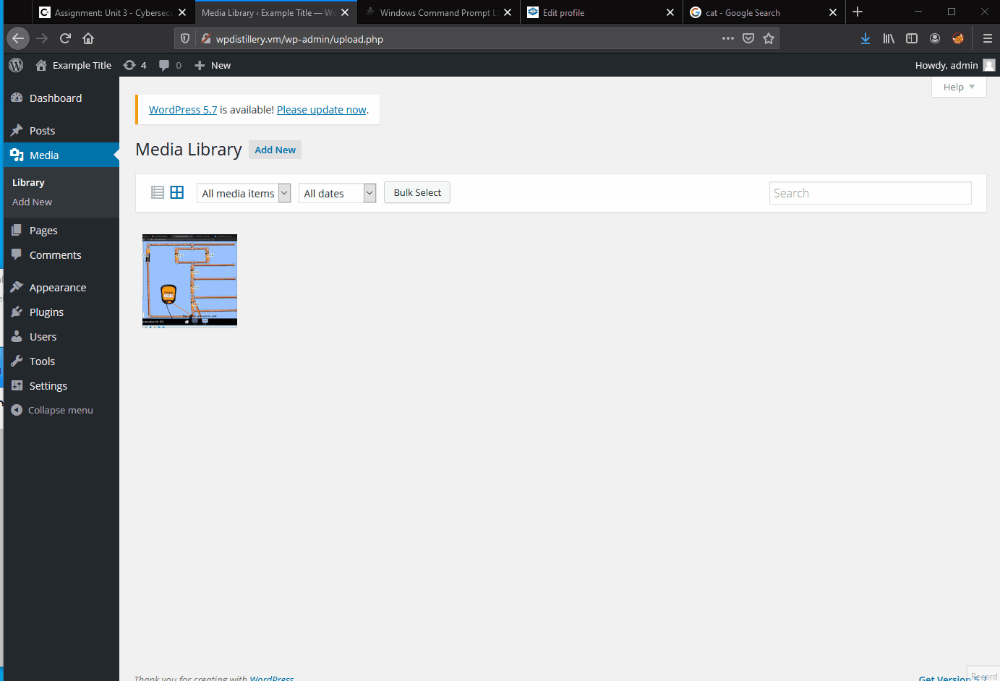
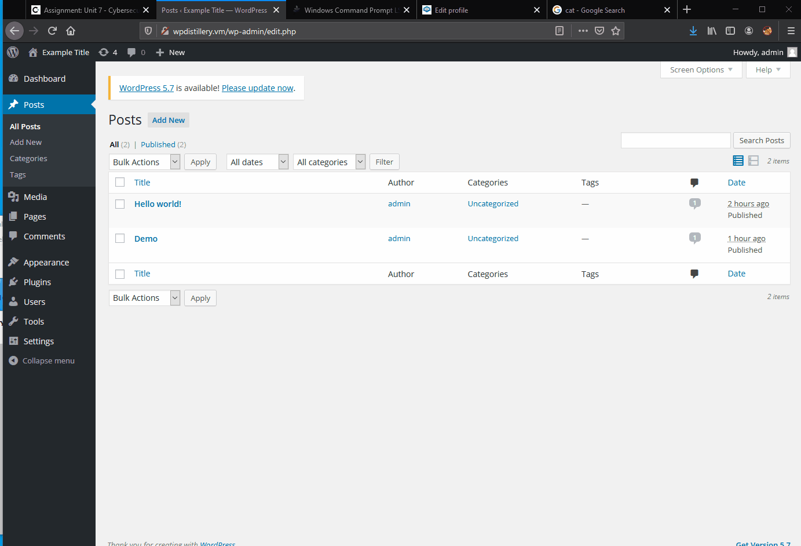
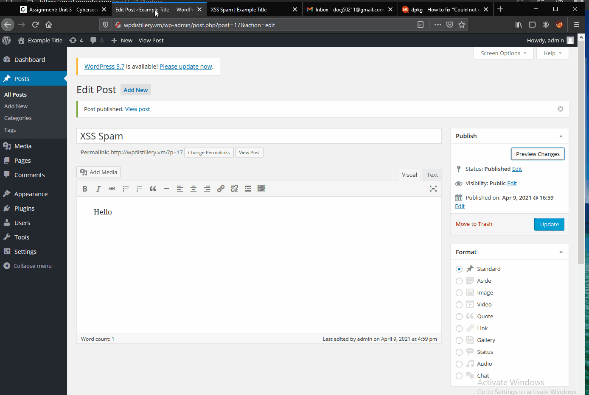

# Project 7 - WordPress Pentesting

Time spent: 13 hours spent in total

> Objective: Find, analyze, recreate, and document 3 affecting WordPress version 4.2

## Pentesting Report

## 1. Reflected XSS
  - Summary:
    The XSS script activates when the viewer loads and views the image on the WordPress page.
    Tested in version: 4.2
    Fixed in version: 4.5.3
  - GIF Walkthrough:
    
  - Steps to recreate:
    1. Once we download or screenshot an image onto our local machine, we then upload it onto the older veresion of WordPress. 
    2. Afterwards, we type in the XSS scipt into the description box of the image.
    3. Once a viewer views the image, the dialogue box of "XSS" would pop up.
    4. Script: 
    ```
    lab<script>alert('xss')</script>
    ```
  - Affected source code: https://core.trac.wordpress.org/browser/tags/4.2/src/wp-admin/images
## 2. Stored XSS
  - Summary:
    The XSS script starts when the user clicks on the link in the comment box on the post.
    Tested in version: 4.2
    Fixed in version: 5.2.3
  - GIF Walkthrough:
    
  - Steps to recreate:
    1. On a WordPress post, post a comment that links with the XSS script.
    2. Make sure to mask the script by naming it to CLICK ME or another string.
    3. Script:
    ```
    <a onclick=alert('xss')>CLICK ME</a>
    ```
  - Affected source code: https://core.trac.wordpress.org/browser/tags/4.2/src/wp-comments-post.php

## 3. CVE-2015-3440 
  - Summary:
    An extremely long unsanitized input leads to malformed HTML due to limitations on the MySQL TEXT data type.  
    Tested in version: 4.2
    Fixed in version: 4.2.1
  - GIF Walkthrough:
    
  - Steps to recreate:
    1. Since we are making an extremely long string to input, we should run a python script to do the work for us.
    2. The code:
    ```python
    output = "<a title='x onmouseover=alert(unescape(/HIHIHII/.source)) style=position:absolute;left:0;top:0;width:5000px;height:5000px  "
    for i in range(64 * 1024):
        output += "D"
    output += "</a>"
    print(output)
    ```
    3. Go to a post and paste the output as a comment.
  - Affected source code: n/a
