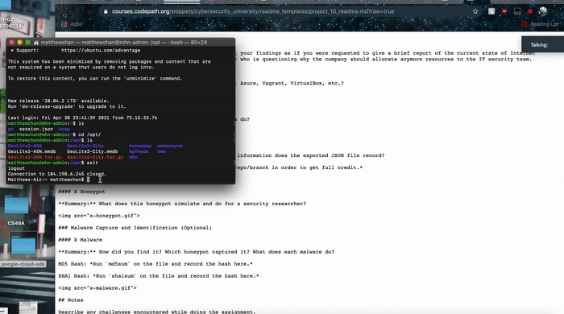

# Honeypot Assignment

**Time spent:** **5** hours spent in total

**Objective:** Create a honeynet using MHN-Admin. Present your findings as if you were requested to give a brief report of the current state of Internet security. Assume that your audience is a current employer who is questioning why the company should allocate anymore resources to the IT security team.

### MHN-Admin Deployment (Required)

**Summary:** I used GCP (Google Cloud Platform) as instructed in the module to deploy both the honeypot and the MHN-Admin as GCP has a free trial. 

### Dionaea Honeypot Deployment

**Summary:** As the name relates to the scientific name of the Venus Flytrap, Dionaea's intention is to attract targets that attack the honeypot to trap malware that exploits the vulnerabilities exposed by services offered by a network. The purpose of this is to get a sample of the malware to study off of.

### Database Backup (Required) 

**Summary:** What is the RDBMS that MHN-Admin uses? What information does the exported JSON file record?

*Be sure to upload session.json directly to this GitHub repo/branch in order to get full credit.*

## Notes

Challenges for this assignment is plentiful as at first, I could not get the ./install.sh to work. Through searching through Google and the Slack channel, I realized I had to change the Flask-SQLAlchemy from 2.3.2 to 2.5.1. Also another problem would be that there were no attacks on the honeypot besides my nmap. However, starting the steps again and doing it on MAC resolved this problem.
