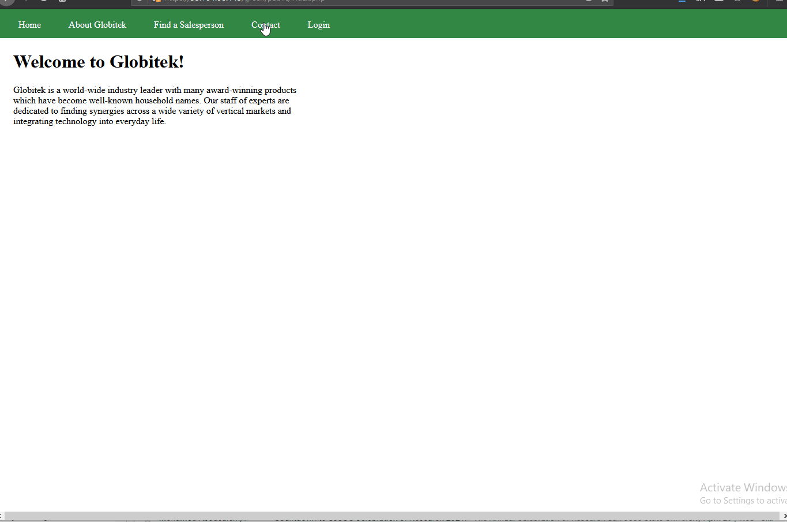

# Project 8 - Pentesting Live Targets

Time spent: 9 hours spent in total

> Objective: Identify vulnerabilities in three different versions of the Globitek website: blue, green, and red.

The six possible exploits are:

* Username Enumeration
* Insecure Direct Object Reference (IDOR)
* SQL Injection (SQLi)
* Cross-Site Scripting (XSS)
* Cross-Site Request Forgery (CSRF)
* Session Hijacking/Fixation

Each color is vulnerable to only 2 of the 6 possible exploits. First discover which color has the specific vulnerability, then write a short description of how to exploit it, and finally demonstrate it using screenshots compiled into a GIF.

## Blue

Vulnerability #1: SQL Injection

Description:
Using the id tag when we click on a salesperson in the "Find a Salesperson" tab, we can enter the following injection:
```
' OR '1=1'#
```
to get a database query failed. This shows that the input is not sanitized and can be exploited using the correct injection.


Vulnerability #2: Session Hijacking/Fixation

Description:
When we change the session id of an unlogged in page to a session id of a logged in page, the unlogged in page becomes the logged in page, which demonstrates a session hijack.


## Green

Vulnerability #1: Cross-Site Scripting (XSS)

Description:
Since the site does not sanitize their feedback input of any tags, we can abuse this by using the code:
```
<script>alert("Why hello there");</script>
```



Vulnerability #2: Username Enumeration

Description:
When we enter our username compared to a random username, we get different values for span class. When the username is correct we get, ```<span class="failure">Log in was unsuccessful.</span>```, and when the username is incorrect, we get ```<span class="failed">Log in was unsuccessful.</span>``` which would mean that we would have a metric in measuring whether our bruteforce on usernames is correct.


## Red

Vulnerability #1: Insecure Direct Object Reference (IDOR)

Description:
When we change the id tag in the URL to 10 or any other salespeople, we get the information on them even if their information should not be public yet. This only works on the Red website as the other two would just redirect the user back to the "Find a Salesperson" page.


Vulnerability #2: Cross-Site Request Forgery (CSRF)

Description:
Unlike other sites, when we change the CSRF token for the red site, the site allows it, which indicates the vulnerability for a CSRF attack. The blue site as demonstrated below generates an error page when we try to change the CSRF token when we are updating the user.


## Bonus Objective 2:

Vulnerability: Cross-Site Scripting

Description:
Expanding on the usage of XSS from the green vulnerability, we can redirect the user to a website of our choosing through inputting the code:
```
<script>window.location="https://www.youtube.com/watch?v=dQw4w9WgXcQ"</script>
```
into the feedback input box. 


## Notes

Not a difficulty but if I were to do the bonus objective with the window.location method, I reroute everyone for a day to a rick roll so I'm sorry about that.

